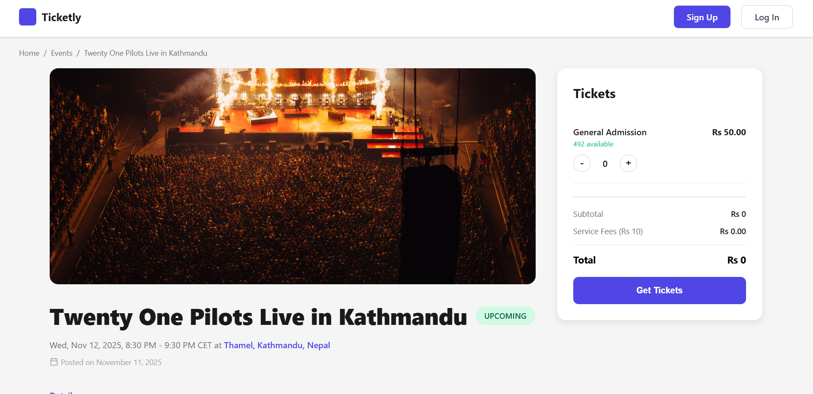
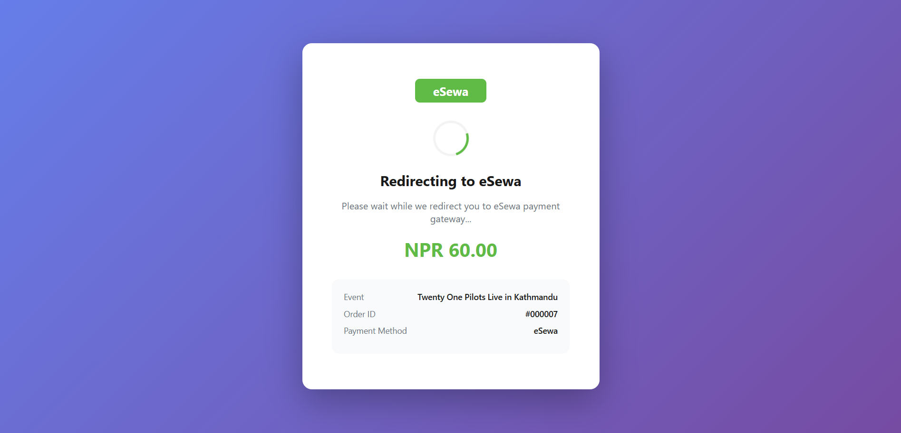
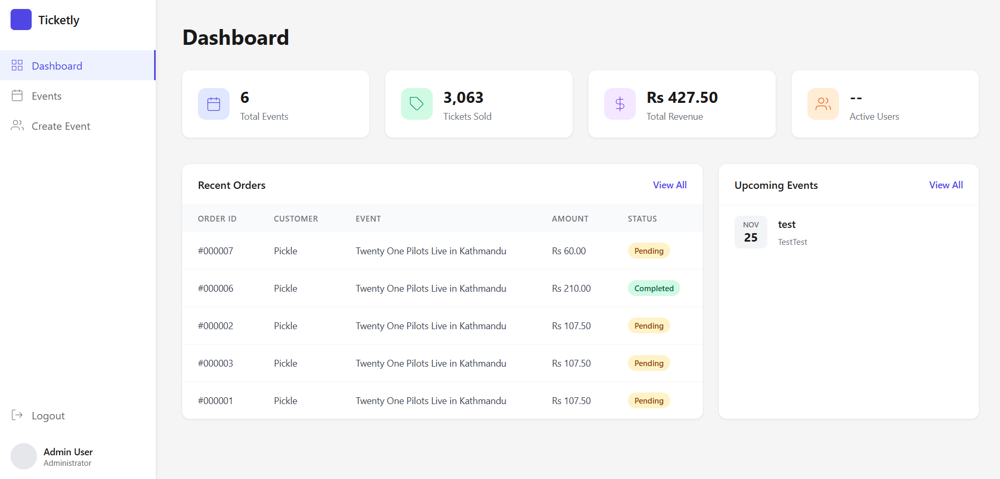

# Events Management System

A comprehensive web-based application for managing events, booking tickets, and processing payments securely. This system facilitates seamless interaction between event organizers (admin) and users.

## 🚀 Features

### User Panel
- **Browse Events**: View a list of upcoming events with details.
- **Search Functionality**: Search for events by name or category.
- **Ticket Booking**: Easy booking process for selected events.
- **eSewa Payment**: Secure online payment integration via eSewa.
- **Purchase History**: View past purchases and ticket status.
- **User Authentication**: Secure login and registration.

### Admin Panel
- **Dashboard**: Overview of total events, purchases, and revenue.
- **Event Management**: Add, edit, and delete events.
- **Purchase Management**: View and manage user purchases.

## 📸 Screenshots

### Home Page

### Event Details

### eSewa Payment

### Admin Dashboard 

## 🛠️ Tech Stack
- **Frontend**: HTML, CSS, JavaScript
- **Backend**: PHP
- **Database**: MySQL
- **Payment Gateway**: eSewa

## ⚙️ Installation & Setup

1. **Clone the Repository** (or extract the zip):
   Place the `events_management` folder inside `htdocs` (e.g., `C:\xampp\htdocs\events_management`).

2. **Database Setup**:
   - Open phpMyAdmin (`http://localhost/phpmyadmin`).
   - Create a new database named `events_management`.
   - Import the SQL file located in `database/events_management.sql` (or similar path if available).

3. **Configuration**:
   - Check `config.php` (or `includes/db.php`) to ensure database credentials match your local setup.

4. **Run the Project**:
   - Open your browser and go to: `http://localhost/events_management`

## 🔐 Demo Credentials

**Admin**
- Username: `admin`
- Password: `admin123`

**User**
- Email: `pickle00@gmail.com`
- Password: `123`
